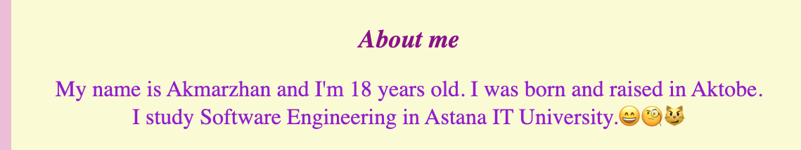
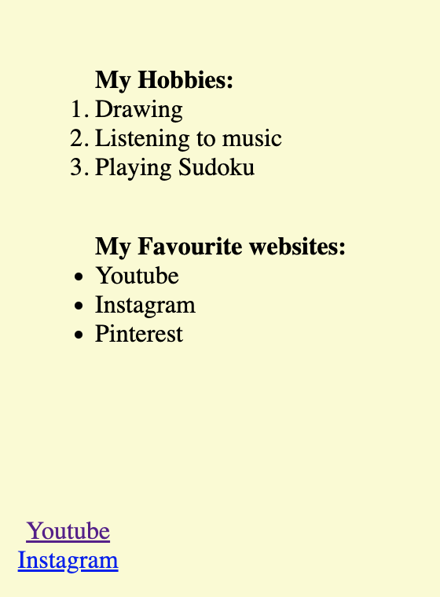
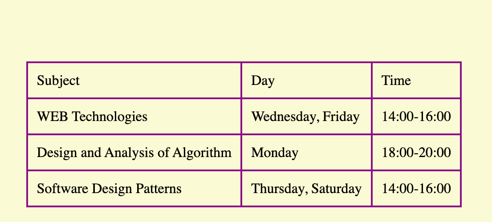
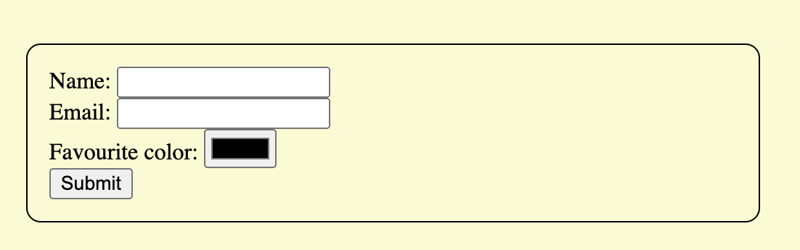
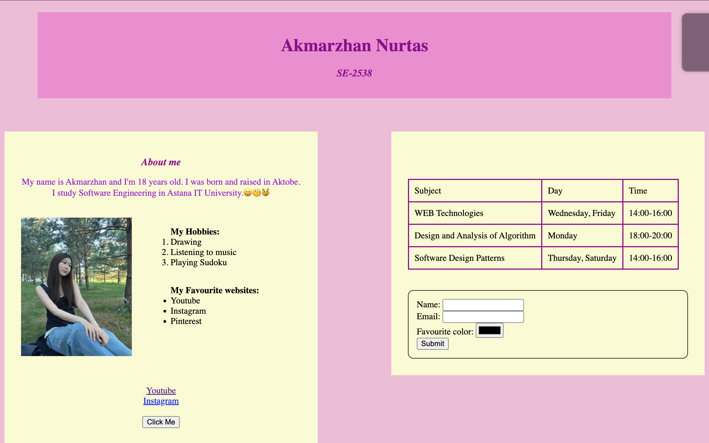

# Personal Webpage Project

## 1. Objective

The objective of this project is to create a webpage using HTML and CSS. My website includes information about me my hobbies, favourite websites, my university schedule and simple forms.

## 2. Technologies Used

* HTML5

* CSS3

## 3. Steps Taken

### Part 1. Personal Information

I created a webpage with my name, student group, age, hometown and details about my university.

### Screenshot

---

### Part 2. Photo, Hobbies and Favourite Websites

I added a photo of myself a list of my hobbies and a list of favourite websites. I also included links to YouTube and Instagram as examples of websites I enjoy.

### Screenshot

---

### Part 3. University Schedule

I created an HTML table that shows my university subjects, class days and class times. I used CSS to add borders and spacing to the table for readability.

### Screenshot

---

### Part 4. Form

I designed a form with input fields for name, email and favourite colour. I also added a submit button to complete the form.

### Screenshot

---

### Part 5. CSS Styling

I created a style.css` file and linked it to my HTML file. I used CSS to change the background colours, fonts, borders, spacing and overall layout of the webpage.

### Screenshot

---

### Part 6. Footer

I added a section at the bottom of the webpage.

### Screenshot

---

## Brief Summary of My Work Process

I started by building the structure of the webpage using HTML. Then I added sections like personal information, a photo, hobbies, favourite websites, a university schedule and a contact form.

After that I created a CSS file and connected it to the HTML file. I used CSS to style the page—changing colours adding borders adjusting fonts controlling spacing and organizing the layout.

During the process I. Fixed several HTML and CSS errors. I also adjusted the positioning of elements to make everything look neat and balanced. Finally I added screenshots of each completed section. Wrote this README file to document my work.

## 4. Webpage Sections

The webpage includes the following sections:

* Header with my name and student group

* About Me

* My Hobbies

* My Favourite Websites

* University Schedule

* Contact Form

* Footer

## 6. Final Reflection

Working on this project helped me learn how to build a webpage using HTML and CSS. I learned how to use headings, paragraphs, images, links, lists, tables, forms, divs and footers.

I also learned how to link an HTML file to a CSS file and apply CSS properties like background colours, borders, padding, margins and positioning.

One of the parts was figuring out how to place elements correctly and fixing CSS mistakes.. Going through these challenges helped me understand how a webpage is structured and improved my skills, in HTML and CSS.

Overall I enjoyed creating my webpage. I gained knowledge and skills that I can use in future web development projects.
